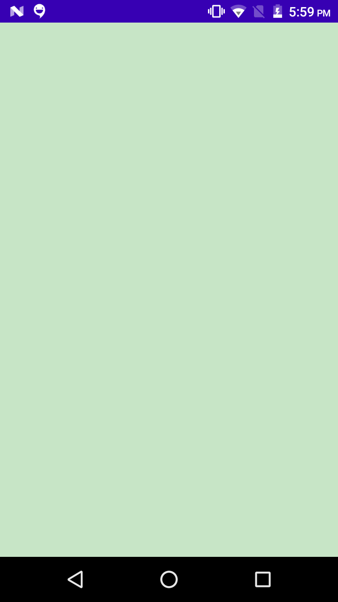
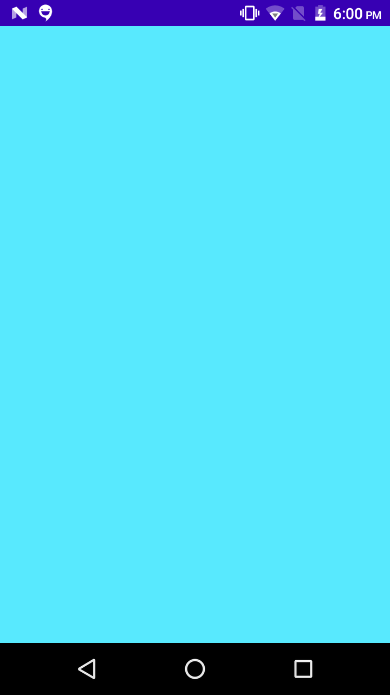

# State With JetPack Compose
#### it descripes how your given UI looks at the movement
#### used to interact with UI componets
#### ReDrawing of UI componets is called Recomposing in JetPack Compose

```
here i have created a simple box clicking on that you can change the bacground color of the box.
```

## Key Learnings from this using jetpackComposeLearning

## How it Works
``
when you click on the screen background color changes with state
``
## Output



## Learning Source
this project is my learning form [youtube][https://www.youtube.com/watch?v=s3m1PSd7VWc&list=PLQkwcJG4YTCSpJ2NLhDTHhi6XBNfk9WiC&index=7]

